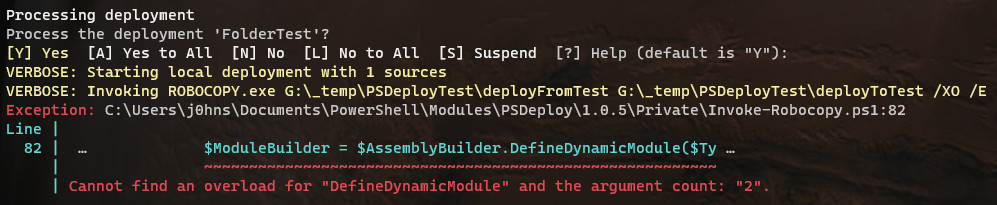

# PSDeployTest

This is just a demo project to help me troubleshoot an error I am getting when using PSDeploy to deploy a folder of script files.

```powershell
# Run this command from the root PSDeployTest folder.
Invoke-PSDeploy -Verbose
```

This is the error I am getting:


